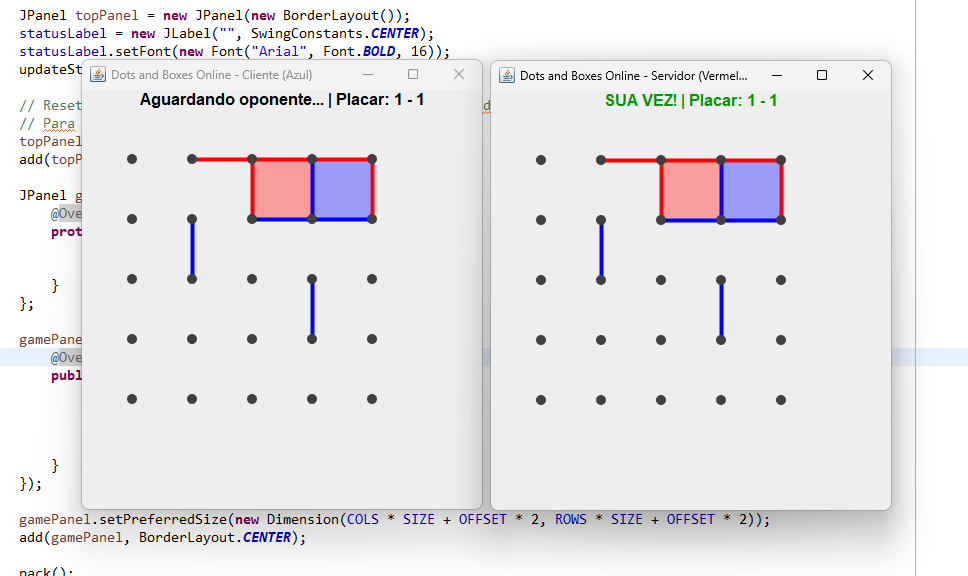

# Dots and Boxes (VIBE Code)

O sistema implementa o jogo Dots and Boxes (Pontos e Caixas) em modo multiplayer online, utilizando:

🖥 Java Swing → Interface gráfica

🌐 Sockets (TCP) → Comunicação em rede

📦 Serialização (Serializable) → Envio de objetos pela rede

🎨 Renderização personalizada com Graphics2D

## O jogo permite:

Criar uma sala (Host / Servidor)

Entrar em uma sala (Cliente)

Jogar alternadamente

Fechar caixas e ganhar ponto extra

Encerrar automaticamente ao completar todas as caixas

### Execução

Clonar projeto;

Importar no Eclipse;

Gerar um Jar executável;

Cada jogador deve executar o comando no terminal:

\> javar -jar DotsAndBoxes.jar

### Screens

